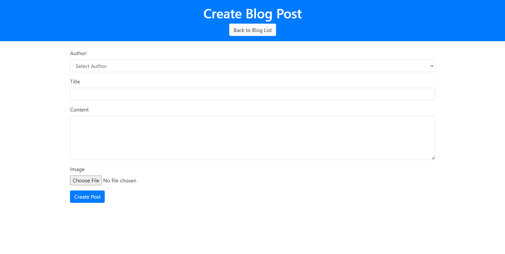
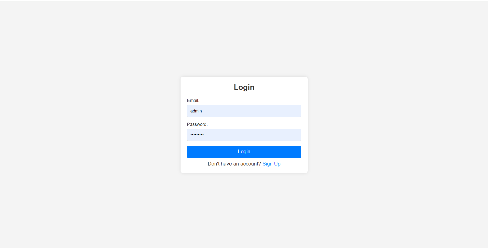
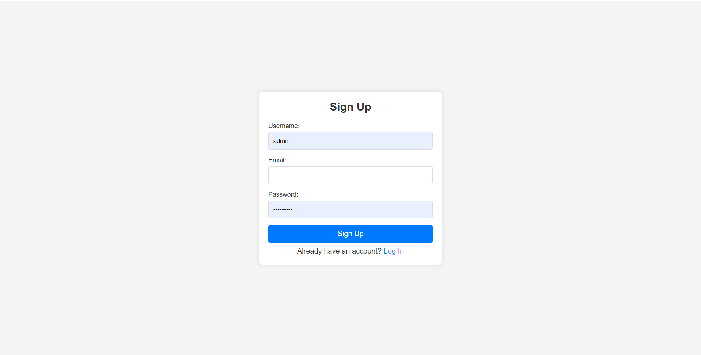
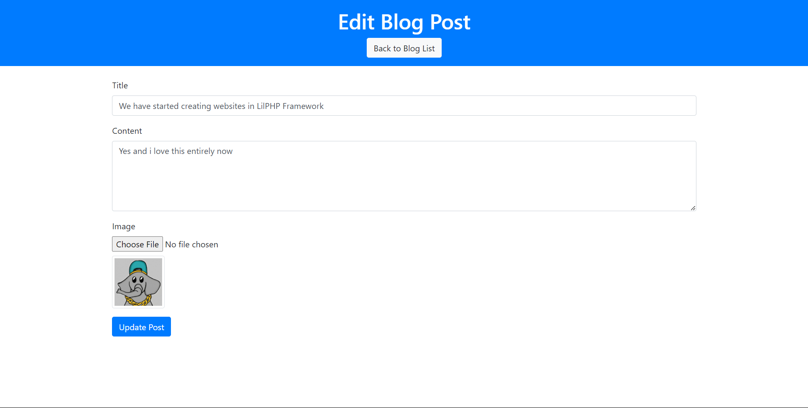
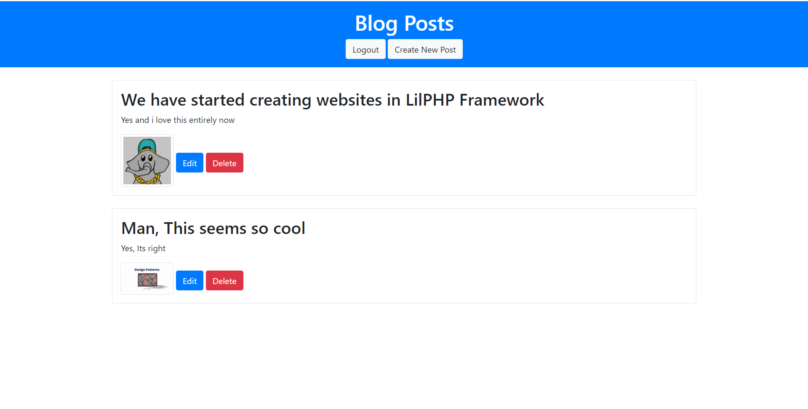

# Sample Blog Website with LilPHP

Welcome to the Sample Blog Website built using the LilPHP framework. This project demonstrates how to create a simple blog with functionalities including user authentication, post creation, editing, and viewing.

## Features

- **User Authentication**: Register, login, and manage user sessions.
- **Post Management**: Create, edit, and view blog posts.

## Screenshots

Here are some screenshots of the blog website:

- **Create Post**
  
  *Description*: A screenshot of the 'Create Post' page where users can draft new blog posts.

- **Login**
  
  *Description*: The login page where users can access their accounts.

- **Signup**
  
  *Description*: The signup page for new users to register.

- **Edit Post**
  
  *Description*: The page where users can edit existing blog posts.

- **View Post**
  
  *Description*: A view of a published blog post.
